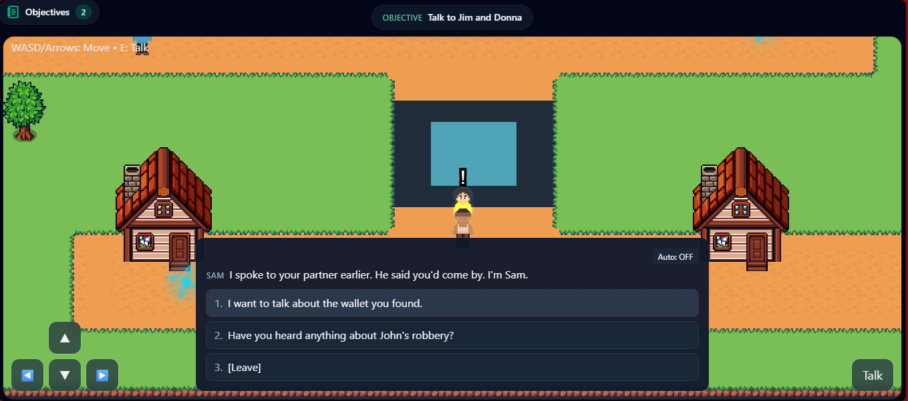
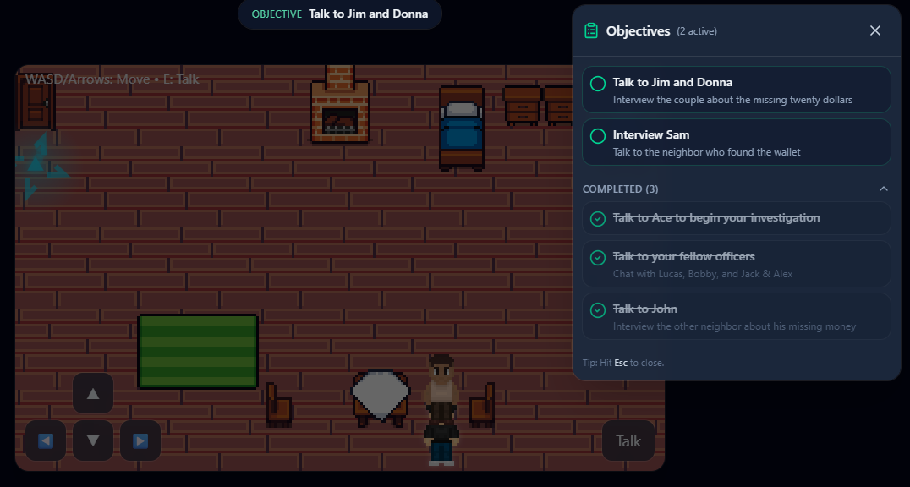
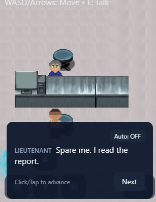
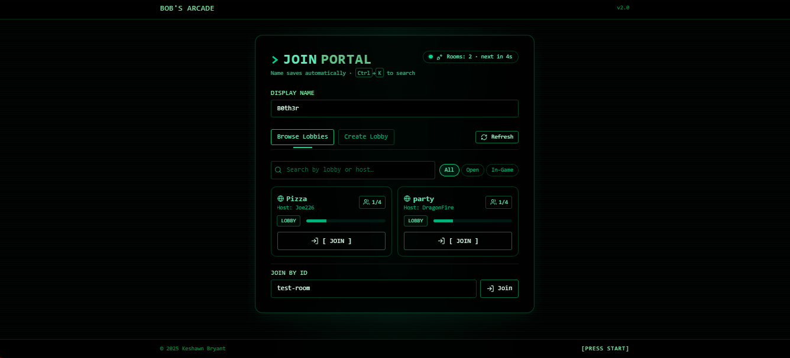
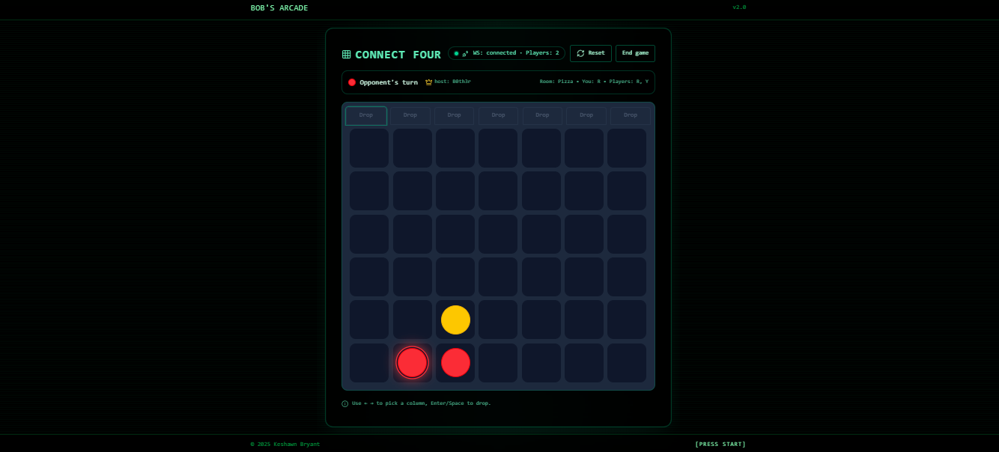
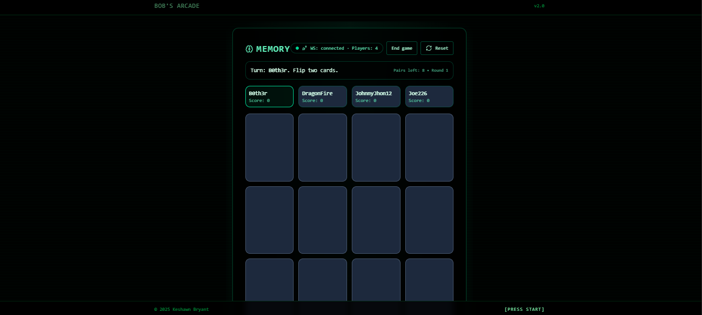

# Arcade Bob

[](LICENSE)
[](https://github.com/B0th3r/Arcade-Bob/releases)
[](https://nodejs.org)

**Live Demo:** [https://arcadebob.com]

**Estimated Playtime:** 30-45 minutes | **Endings:** Multiple (good, bad, secret)

---

## Technical Highlights

<details>
<summary><b>🔧 For Recruiters/Engineers (click to expand)</b></summary>

**What makes this technically interesting:**

- **Custom game engine** Custom 2D tile-based rendering and game loop with no external game frameworks
- **State-driven dialogue** with flags, conditional branching, and dynamic scoring (interrogation points evaluated in real-time)
- **Modular architecture** — Dialogue nodes use `onEnter` hooks for complex logic (poem coherence scoring, evidence weight calculations)
- **Real-time multiplayer** via WebSocket — Pluggable game system with reducer-based state management
- **Performance optimizations** — Offscreen buffering and viewport culling to reduce draw calls
- **Tiled map integration** — Custom TMJ parser, GID decoding, multi-tileset support, async asset loading
- **Audio system** — Voice playback manager with auto-progression timing and manual override

**Tech Stack:** React + Vite, Node.js + Socket.IO, Web Audio API, Canvas API, custom state machine

See [Technical Architecture](#technical-architecture) section below for implementation details.

</details>

---

## Story Overview

You're a detective in hot water. After pushing a witness too hard, they lawyered up and your last case went cold. The Lieutenant isn't happy and neither is the rest of the department.

Your punishment? Babysitting rookie Detective Hayes on a "simple" neighborhood robbery:
- **The Crime:** Jim's wallet was stolen, $20 missing. Neighbor John claims he was also robbed but never reported it.
- **The Twist:** Someone's lying, and if you screw this up, you might be the one in cuffs.
- **The Stakes:** Prove you can be trusted around people again or lose your badge.

But this isn't just about solving a case. Lucas needs dating advice. Tim's causing drama. And Marcus is watching every move you make.

**Can you solve the case without burning another lead?**

---

## Key Features

### 🎭 Consequence-Driven Investigation
- **Dynamic interrogation scoring** — Ask the right questions (+pts), press too hard (-pts)
- **Multiple fail states** — Suspects can lawyer up, you can arrest the wrong person, or even get arrested yourself
- **Branching reputation system** — Your choices with the Lieutenant, Hayes, and suspects shape your ending

### 🗣️ Fully Voiced Dialogue System
- **600+ voiced lines** across 20+ NPCs
- **Conditional dialogue trees** — Past choices unlock (or lock) conversation options
- **Evidence-based conversations** — Present clues to break suspects or lose their trust

### 🕵️ Investigation Mechanics
- **Evidence gathering** — Talk to neighbors, collect alibis, spot inconsistencies
- **Quest system** — Track main objectives and optional side stories
- **Waypoint markers** — NPCs glow when you're close, objectives guide you to key locations

### 🌆 Explorable World
- **3 main maps** (Police Station, Neighborhood, The Bar)
- **Side stories** — Help Lucas with his love life, avoid Tim's chaos, earn Marcus's respect
- **Mobile-friendly** — Touch controls with haptic feedback + D-pad

---

## Multiplayer Arcade

When you need a break from detective work, challenge friends in **real-time arcade classics**:

### Available Games
- **Tic-Tac-Toe** — Quick strategic matches
- **Connect Four** — Gravity-based pattern building
- **Battleship** — Naval combat with hidden ship placement
- **Blackjack** — Card game with dealer
- **Memory Matching** — Test your recall
- **Mahjong** — Tile matching puzzle

### Multiplayer Features
- **WebSocket-based rooms** — Create/join with room codes
- **Host controls** — Room creator chooses games and manages sessions
- **Spectator mode** — Watch live matches without interfering
- **Real-time sync** — Instant move updates via Socket.IO
- **Graceful handling** — Disconnects, host migration, error recovery

### Technical Implementation
Built on a **pluggable game architecture** where each game exports:
- `initialState` — Starting game configuration
- `reducer(state, action)` — Pure function for state updates
- `serialize()` — State representation

---

## Screenshots

### Story Mode: Detective Investigation
  
*Question suspects, gather evidence, spot the lies.*

  
*Track leads and case progress with a dynamic objective system.*

  
*Your boss is not happy. Choose your words carefully.*

### Multiplayer: Arcade Classics
  
*Create or join rooms with friends*

  
*Retro lobby system*

  
*Real-time Connect Four match*

  
*Memory matching game*

---

## Tech Stack

- **Engine:** Custom 2D tile-based renderer with Tiled map support (.tmj)
- **Dialogue System:** Conditional branching with flag/clue/metadata tracking
- **Audio:** Web Audio API with voice playback + auto-progression timing
- **Scoring:** Dynamic evaluation (interrogation points, poem coherence, evidence)
- **Frontend:** React, Vite, Tailwind CSS
- **Multiplayer Backend:** Node.js, Express, Socket.IO
- **Architecture:** Monorepo (`/client` for story mode + arcade, `/server` for multiplayer)

---

## Technical Architecture


**Rendering Pipeline**
- **Offscreen canvas buffering** — Pre-renders entire map to buffer, then draws viewport slice each frame
- **Camera system** — Smooth tracking with configurable bounds, supports viewport scaling for mobile
- **Layered rendering** — Base tiles → NPCs → waypoint markers → player sprite → UI overlay
- **Sprite animation** — Frame based animation system with configurable timing (idle: 600ms, walk: 150ms)
```javascript
// Viewport culling optimization
const visibleTiles = {
  startX: Math.max(0, camera.x),
  startY: Math.max(0, camera.y),
  endX: Math.min(mapWidth, camera.x + viewCols),
  endY: Math.min(mapHeight, camera.y + viewRows)
};
// Only render what's on screen
```

**Collision & Movement**
- **Grid-based collision detection** — Parses Tiled collision layers, builds collision map
- **Movement cooldown system** — Prevents rapid inputs (110ms debounce)
- **Smooth camera lerping** — Player stays centered, camera interpolates to new position
- **Mobile touch controls** — Custom D-pad with pointer events + haptic feedback

**Map Loading & Transitions**
- **Tiled TMJ parser** — Reads layered maps, tileset metadata, object layers (NPCs, triggers)
- **GID decoding** — Handles flipped tiles, tileset indexing, multi-tileset support
- **Async asset loading** — Preloads tilesets + NPC spritesheets before map render

### Dialogue Engine
State-driven conversation system with complex conditional logic:

**Core Architecture**
```javascript
// Node structure
{
  segments: [
    { 
      speaker: "npc", 
      text: "Dialogue here", 
      voice: "audio_file",
      requires: { flagsAll: ["flag1"], notClues: ["clue2"] } // Conditional rendering
    }
  ],
  choices: [
    { 
      label: "Response", 
      next: "node_id",
      set: { flagsAdd: ["new_flag"], cluesAdd: ["evidence"] }
    }
  ],
  onEnter: (gameState) => { /* Dynamic scoring logic */ }
}
```
### Quest/Objective System
Dynamic waypoint tracking tied to story state with conditional appearance logic:

**Objective Configuration**
```javascript
// Objectives defined declaratively with appearance/completion conditions
const OBJECTIVES_CONFIG = {
  talk_to_jim: {
    id: 'talk_to_jim',
    title: 'Talk to Jim and Donna',
    description: 'Interview the couple about the missing twenty dollars',
    appearsWhen: { flagsAll: ["debriefed"] },        // Only appears after briefing
    completesWhen: { flagsAny: ['talkedToJim', 'talkedToDonna'] }, // Complete when either flag set
    waypoints: [
      { type: "npc", id: "jim" },
      { type: "npc", id: "donna", hideWhenFlag: "talkedToDonna" } // Waypoint disappears when complete
    ]
  },
  help_bobby: {
    id: 'help_bobby',
    title: '(OPTIONAL) Help Bobby with his investigation',
    optional: true,                                    // Optional objectives styled differently
    appearsWhen: { flagsAll: ['bobby_investigation_bar'] },
    completesWhen: { flagsAny: ['met_bobby_in_bar'] },
    waypoint: { type: "npc", id: "bobby" }
  }
};
```

**Conditional Logic Engine**
- **Appearance conditions** — `flagsAll`, `flagsAny`, `cluesAll`, `metadataAll` (all must match)
- **Completion conditions** — Same logic, but for marking objectives done
- **Hide conditions** — Individual waypoints can disappear mid-objective (e.g., "talk to 3 witnesses" removes markers as you complete each)
- **Required vs Optional** — Optional objectives styled with amber accent

**UI/UX Features**
- **Floating FAB button** — Shows active objective count
- **Bottom sheet (mobile) / Side panel (desktop)** — Responsive design pattern
- **Collapsible completed section** — Keeps focus on active tasks
- **Auto-sorting** — Required objectives always listed first, optional below
- **Live updates** — React useEffect watches `gameState` and `refreshToken` for instant sync

**Waypoint Rendering Integration**
```javascript
// Renders markers on canvas for active objectives
for (const objective of activeObjectives) {
  const waypoints = objective.waypoints || [objective.waypoint];
  
  for (const wp of waypoints) {
    // Skip if waypoint has hideWhenFlag and flag is set
    if (wp.hideWhenFlag && gameState.flags.has(wp.hideWhenFlag)) continue;
    
    const npc = npcs.find(n => n.id === wp.id);
    if (npc) {
      const screenX = (npc.x - camera.x) * tileWidth;
      const screenY = (npc.y - camera.y) * tileHeight;
      drawWaypointMarker(ctx, screenX, screenY, objective.optional);
    }
  }
}
```

### WebSocket Multiplayer (Arcade Mode)
Real-time game rooms with state synchronization:

**Server Architecture**
```javascript
// Room-based game state
class Room {
  constructor(id) {
    this.id = id;
    this.players = new Map();
    this.host = null;
    this.game = null; // Pluggable game instance
    this.phase = "lobby"; // lobby | playing | ended
  }
}

// Event handling
socket.on("action", (data, ack) => {
  const room = rooms.get(socket.roomId);
  const result = room.game.reducer(room.game.state, data);
  
  if (result.error) return ack.err(result.error);
  
  room.game.state = result.state;
  io.to(room.id).emit("state", room.serialize());
  ack.ok();
});
```

**Game Plugin System**
- Each game (Connect4, Battleship, etc.) exports: `initialState`, `reducer`, `serialize`
- Server agnostic to game rules — just pipes actions through reducers
- Client handles rendering, server handles validation + broadcast

**Error Handling**
- Rate limiting (5 actions/sec per player)
- Input validation (schema checking on actions)
- Graceful disconnects (host migration, spectator conversion)
- Typed error codes (`RATE_LIMIT`, `NOT_HOST`, `INVALID_MOVE`)

---

## Code Quality & Patterns

### State Management
```javascript
// Centralized game state (no external library)
const GAME = {
  flags: new Set(),           // Story progression
  clues: new Set(),           // Evidence tracking
  metadata: new Map(),        // Scored values
  currentMap: "city",
  playerPosition: { x: 3, y: 3 }
};

// Pure functions for state updates
const hasFlag = (f) => GAME.flags.has(f);
const addClue = (c) => GAME.clues.add(c);
```

---

## Quickstart

### Requirements
- Node.js 18+
- npm

```bash
# Clone
git clone https://github.com/B0th3r/Arcade-Bob.git
cd Arcade-Bob

# Server (for multiplayer)
cd server
npm install
npm run dev  # http://localhost:4000

# Client (story mode + multiplayer frontend)
cd ../client
npm install
npm run dev  # http://localhost:5173
```

**Story Mode:** Navigate to the story mode route (detective investigation)  
**Multiplayer:** Open multiple tabs to play arcade games with friends

---

## Controls

### Desktop
- **WASD / Arrow Keys** — Move detective
- **E** — Talk to NPCs / Advance dialogue
- **Mouse** — Select dialogue choices

### Mobile
- **On-screen D-pad** — Movement
- **Talk button** — Interact
- **Tap choices** — Select responses
- **Haptic feedback** — Confirms inputs

---

## Storymode Credits

### Voice Cast
**Ace** — Actor | **Alex** — Henry | **Bartender** — Keshawn | **Bobby** — Michael | **Delivery Girl** — Saisindhu | **Donna** — Riana | **Florist** — Anonymous | **Flower Promoter** — Anonymous | **Gambler** — Jaime | **Hayes** — Garnett | **Jack** — Keshawn | **Jane** — Kiona | **Jim** — Keshawn | **John** — Henry | **Lieutenant** — Robbie | **Lucas** — Marcus | **Marcus** — Eli | **Maya** — Michaela | **Sam** — Jewelean | **Tim** — Daniel

### Tilesets & Art
- **35 Character Pixel Art** — yigitkinis
- **Farm RPG 16x16 Tileset** — Emanuelle
- **Pixel Cyberpunk Interior** — DyLESTorm
- **City Pack** — NYKNCK
- **Village Building Interior Tileset** — ay boy

---

## License

MIT License — see [LICENSE](LICENSE) for details.
