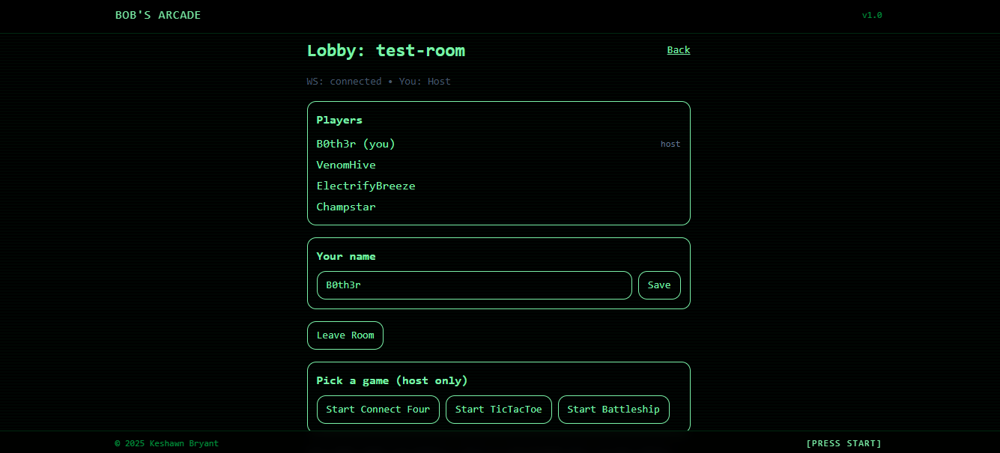
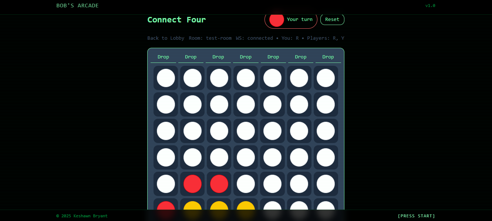

# Multiplayer Game Server

[](LICENSE)
[](https://github.com/B0th3r/Multiplayer-Game-Server/releases)
[](https://nodejs.org)

Real-time multiplayer platform with a **retro arcade web client**.  
Play classics like **Tic-Tac-Toe, Connect Four, and Battleship** with live rooms, host controls, and spectators.

**Live Demo:** [https://arcadebob.com]

---

## Features

- **Real-time gameplay** via WebSockets (Socket.IO)  
- **Game lobby system** with host/room management  
- **Multiple games built in** (Tic-Tac-Toe, Connect Four, Battleship)  
- **Spectator mode** for watching live games  
- **Modular game API** — easily add new games  

---

## Demo

  
*Retro lobby with room creation/join flow*  

  
*Real-time Connect Four match in progress*  

---

## Tech Stack

- **Backend:** Node.js, Express, Socket.IO  
- **Frontend:** React, Vite, Tailwind CSS  
- **Architecture:** Monorepo (`/client`, `/server`)  

---

## Quickstart

Clone the repo and run locally:

```bash
# Clone
git clone https://github.com/B0th3r/Multiplayer-Game-Server.git
cd Multiplayer-Game-Server

# Server
cd server
npm install
npm run dev  # http://localhost:4000

# Client
cd ../client
npm install
npm run dev  # http://localhost:5173
```

Open multiple browser tabs at `http://localhost:5173` to simulate players.  

---

## Configuration

**Server (`server/.env`):**
```ini
PORT=4000
CORS_ORIGIN=http://localhost:5173
```

**Client (`client/.env.local`):**
```ini
VITE_WS_URL=http://localhost:4000
```

---

## Socket Events (Short)

Client → Server
- `join { roomId, name }` → ack
- `set_name { name }` → ack
- `host_choose_game { gameId }` → ack
- `host_end_game` → ack
- `action { type, payload }` → ack
- `reset` → ack
- `leave_room`

Server → Client
- `you { id, host }`
- `phase { roomId, hostId, phase, gameId | null }`
- `state { ...serializedRoomAndGame }`
- `left` (after `leave_room`)

**Ack shape:** `ok(payload?)` or `err(code, details?)`  
**Error codes:** `RATE_LIMIT`, `BAD_INPUT`, `NO_ROOM`, `NOT_HOST`, `UNKNOWN_GAME`, `NEED_PLAYERS`, `NO_GAME`, `CANNOT_ACT`, `REDUCE_ERROR`, `NOT_A_PLAYER`.

---

## Limitations

- **In-memory state only** (rooms reset on server restart)  
- **No user accounts** — names are temporary and not enforced unique   

---

## Releases

- **v1.0.0** – Initial release with Tic-Tac-Toe, Connect Four, Battleship, lobby system.  

See [Releases](https://github.com/B0th3r/Multiplayer-Game-Server/releases) for details.  

---

## License

MIT License – see [LICENSE](LICENSE) for details.
